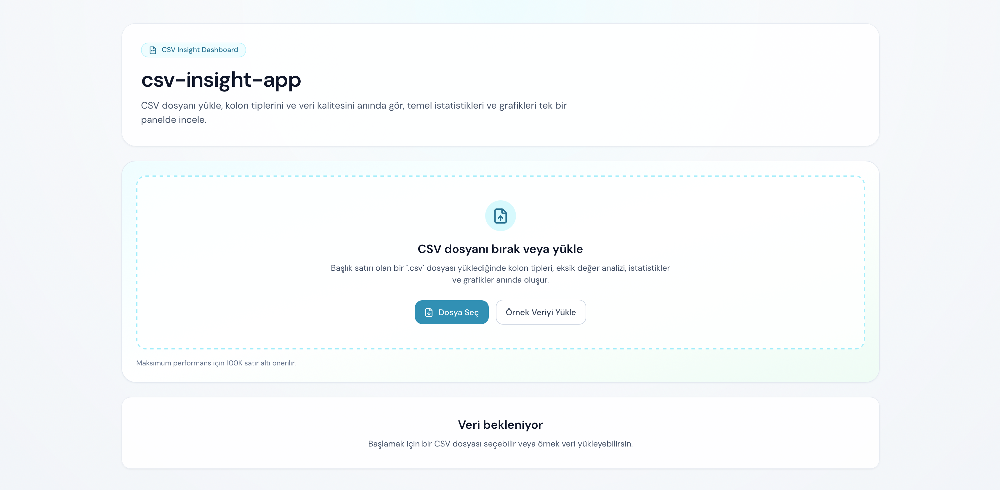
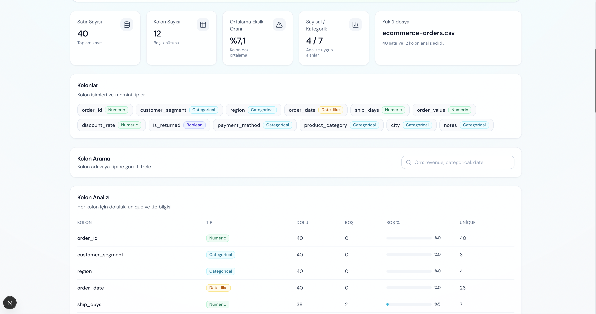
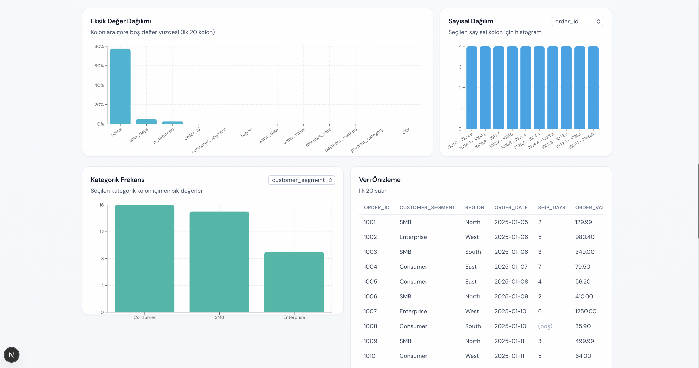

# csv-insight-app

CSV dosyalarını tarayıcıda anında analiz eden modern bir dashboard uygulaması.

Kullanıcı bir CSV dosyası yükler ve tek ekranda şu çıktıları görür:
- veri seti özeti
- kolon bazlı kalite analizi
- sayısal istatistikler
- kategorik dağılımlar
- veri önizleme tablosu
- etkileşimli grafikler

Uygulama tamamen frontend tarafında çalışır; backend gerektirmez.

## Öne Çıkan Özellikler

- Sürükle-bırak veya dosya seçici ile CSV yükleme
- Geçersiz/boş dosyalarda kullanıcı dostu hata mesajları
- Otomatik başlık işleme ve kirli CSV satırlarına dayanıklı parse akışı
- Kolon tipi tahmini:
  - `numeric`
  - `categorical`
  - `boolean`
  - `date-like`
  - `text`
- Kolon analizi:
  - dolu değer sayısı
  - boş değer sayısı
  - boş değer yüzdesi
  - unique değer sayısı
- Sayısal özet:
  - count
  - min / max
  - mean
  - median
  - standard deviation
- Kategorik özet:
  - unique count
  - en sık ilk 5 değer
- İlk 20 satır için veri önizleme tablosu
- Grafikler:
  - kolon bazlı eksik değer oranı
  - seçilen sayısal kolon için histogram
  - seçilen kategorik kolon için frekans grafiği
- Kolon arama/filtreleme
- Analiz özetini JSON olarak indirme
- Demo için örnek CSV dataset

## Teknoloji Yığını

- Next.js (App Router)
- TypeScript
- Tailwind CSS v4
- PapaParse
- Recharts
- Lucide React

## Hızlı Başlangıç

### 1) Kurulum

```bash
npm install
```

### 2) Geliştirme Ortamında Çalıştırma

```bash
npm run dev
```

Ardından `http://localhost:3000` adresine git.

### 3) Production Build

```bash
npm run build
npm run start
```

### 4) Kod Kalitesi Kontrolü

```bash
npm run lint
```

## Kullanım Akışı

1. Uygulamayı aç.
2. Kendi `.csv` dosyanı yükle veya `Örnek Veriyi Yükle` butonunu kullan.
3. Dashboard kartlarında genel metrikleri incele.
4. Kolon analiz tablosu ve özet tablolarla veri kalitesini değerlendir.
5. Grafik bölümünden dağılım/frekans içgörülerini gör.
6. Gerekirse analiz çıktısını JSON olarak indir.

## Ekran Görüntüleri

### Genel Bakış


### Kolon Analizi


### Grafikler


## Proje Yapısı

```text
csv-insight-app/
├── app/
│   ├── globals.css
│   ├── layout.tsx
│   └── page.tsx
├── components/
│   ├── charts/
│   │   ├── categorical-top-chart.tsx
│   │   ├── missing-values-chart.tsx
│   │   └── numeric-distribution-chart.tsx
│   ├── dashboard/
│   │   ├── columns-glance.tsx
│   │   ├── csv-insight-dashboard.tsx
│   │   └── dataset-overview.tsx
│   ├── tables/
│   │   ├── categorical-summary-table.tsx
│   │   ├── column-analysis-table.tsx
│   │   ├── data-preview-table.tsx
│   │   └── numeric-summary-table.tsx
│   ├── ui/
│   │   └── card.tsx
│   └── upload/
│       └── upload-zone.tsx
├── lib/
│   ├── analysis/
│   │   ├── csv-analysis.ts
│   │   ├── helpers.ts
│   │   └── types.ts
│   └── utils.ts
├── public/
│   └── sample-data/
│       └── ecommerce-orders.csv
├── package.json
└── README.md
```

## Analiz Mantığı Notları

- Boş string, `na`, `n/a`, `null`, `undefined`, `-` gibi değerler `missing` kabul edilir.
- CSV parse sonrası başlıklar normalize edilir; boş/tekrarlı başlıklar güvenli hale getirilir.
- Tip tahmini örnek değerlerin oranına bakılarak yapılır.
- Histogram verisi sayısal kolon değerlerinden dinamik aralıklarla üretilir.

## Örnek Veri

Demo dosyası:

`public/sample-data/ecommerce-orders.csv`

Bu dosya; sayısal, kategorik, boolean, tarih-benzeri ve eksik değer örnekleri içerir.


## Lisans

Bu proje eğitim ve portföy amaçlıdır. İstersen doğrudan kendi kullanımına göre özelleştirebilirsin.
